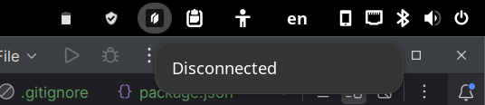

# Twingate status icon
This Gnome Shell extension shows a status icon on the Gnome top bar indicating Twingate's connection status.
Clicking on the menu entry starts or stops the connection.



## Requirements
Twingate for Linux should be installed before this extension. Your system should use Systemd (or have a `systemctl` shim).

## Compatibility
Tested working on Arch/Manjaro. 

This extension calls the following commands. If these don't work when you run them manually the extension won't be able to change the connection status.

```shell
systemctl stop twingate
systemctl stop --user twingate-desktop-notifier
```

```shell
systemctl start twingate
systemctl start --user twingate-desktop-notifier
```

